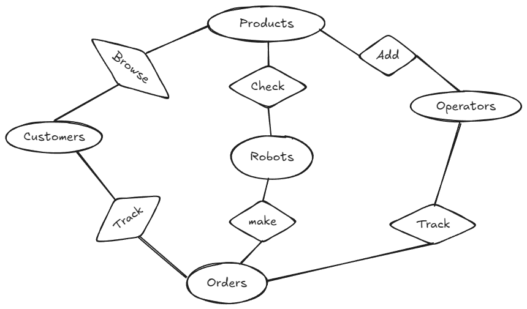
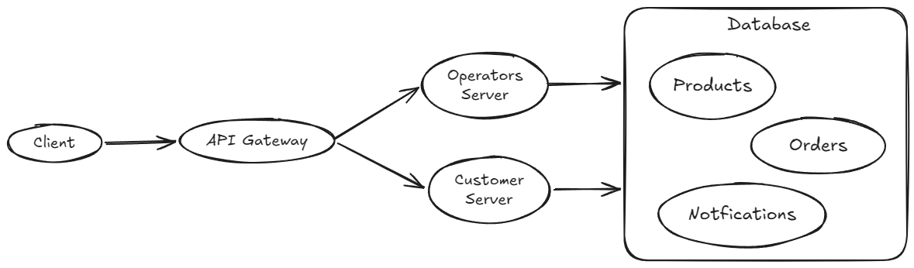
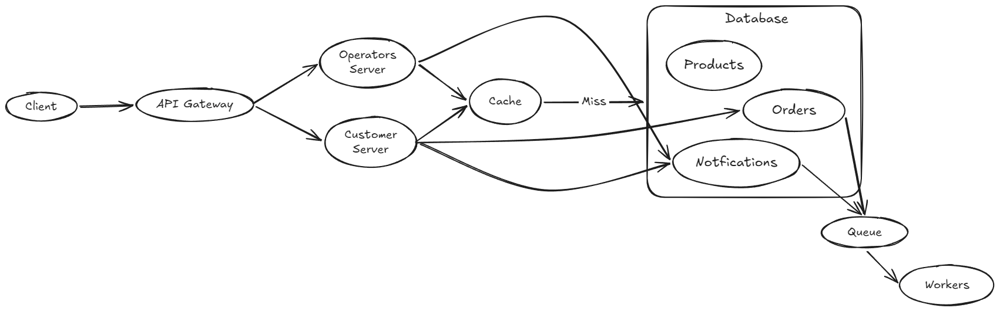

# Wahdy_Aref_Howa_Da_Dor_ElBotola

# 1.Functional Requirements
  1.	System should manage orders & products
  2.	System shall check that there is no duplication
  3.	System should check the availability of each item
  4.	System shall prevent overselling
  5.	System should calculate how many robots are needed to collect order
  6.	System should check that robots are doing tasks in the right way
  7.	System should show a live status to the warehouse operator
  8.	System should notify operators & customers about important events
  9.	System should allow customers to browse orders & track their orders

---

# 2.Non-Functional Requirements

  1.	System should check items with low latency 
  2.	System should be scalable for large community
  3.	System should be maintainable to be easier to fix any bug
  4.	System should be reliable with the users

---

# 3.Data Model

  Entities: Products - Customers - Operators - Robots - Orders
  

---

# 4.API Design

  ### Check Product   
	  GET/Product/{product_id} ----> Product

  ### Make Order  
  	POST/Order  
  	body:{  
  		“products”: String[],  
  		“price”: Double  
  }  
  ### Get Status  
  	GET/order_status/{order_id} ----> Order_status  

  ### Add Product  
    POST/Product  
    body:{  
      “name”: string,  
      “price”: Double  
    }  

---

# 5.High Level Archeticture
	Client go to the API Gateway and from it go to the server that has it's services and save new operations on database or get from it

---

# 6.Deep Dives
	Problem1: User can check the same product multiple time
	Trade-off: Use cache to save visited sites and make the latency be lower

	Problem2: When user make order or receives notifications it consumes time from the server
	Trade-off: Use Queue to make this work beside the current work

